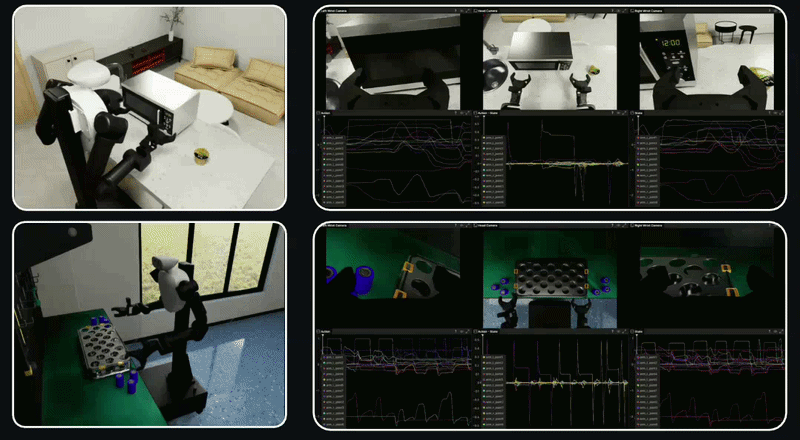
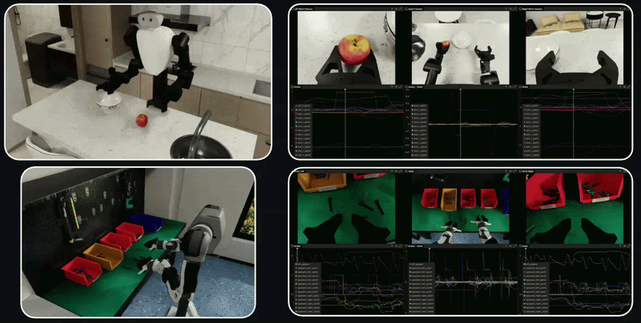
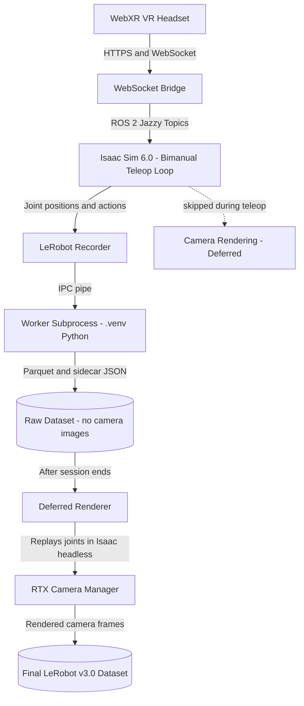

# TeleSim

**TeleSim** is a VR teleoperation and dataset collection platform for **NVIDIA Isaac Sim 6.0**.
Control multiple bimanual robots using any **WebXR-compatible VR headset** (tested on Meta Quest 3)
and record datasets in **LeRobot v3.0 format** — with a fully decoupled, latency-optimized recording pipeline.

---

## Overview

TeleSim streams 6-DoF controller poses from a **WebXR-compatible VR headset** over WebSocket to ROS 2 topics, which Isaac Sim consumes to run real-time inverse-kinematics on bimanual robot arms. A key architectural feature is **deferred rendering**: camera images are not captured during the live teleoperation loop (keeping the control loop fast), and are rendered offline in a separate Isaac Sim headless pass after the session ends.

**Key capabilities:**

- 🤖 **Multi-robot support** — OpenArm Bimanual, AC One, FFW BG2, all from the same codebase
- ⚡ **Decoupled recording** — joint trajectories saved live; camera frames rendered offline to avoid GPU latency
- 📦 **LeRobot v3.0 datasets** — out-of-the-box dataset writing with a subprocess worker, compatible with HuggingFace
- 🎲 **Domain randomization** — per-episode object and lighting randomization with exact scene replay during deferred rendering
- 🌐 **Flexible networking** — LAN direct, VPN/remote ingress, and WebRTC viewport streaming
- 📊 **Built-in latency metrics** — real-time control loop and transport diagnostics

---

## Demo

<table>
  <tr>
    <td align="center" width="33%">
      
    </td>
    <td align="center" width="33%">
      
    </td>
    <td align="center" width="33%">
      
    </td>
  </tr>
</table>

---

## System Architecture




> **Why deferred rendering?** GPU rendering is the single biggest source of latency in the control loop.
> By skipping camera capture during teleop and replaying joint trajectories offline, the live loop can
> run at 60–120 Hz while still producing high-quality camera observations in the dataset.

---

## Prerequisites

| Requirement | Version / Notes |
|-------------|----------------|
| **OS** | Ubuntu 24.04 |
| **GPU** | NVIDIA RTX (RTX 3080 or better recommended) |
| **Isaac Sim** | 6.0 (installed separately — [NVIDIA Omniverse](https://developer.nvidia.com/isaac/sim)) |
| **ROS 2** | **Jazzy** (bundled with Isaac Sim 6.0 — no separate install needed) |
| **Python** | 3.10+ |
| **uv** | Python package manager — [install uv](https://docs.astral.sh/uv/getting-started/installation/) |
| **VR Headset** | Any WebXR-capable browser on a VR headset (tested on Meta Quest 3). Must be on the same WiFi network as the PC, or connected via VPN. |

> **No extra robot assets needed**: All USD/URDF files for OpenArm, AC One, and FFW BG2 are bundled
> under `robot_configs/` in the repository.

---

## Installation

### Step 1 — Clone and create the virtual environment

```bash
git clone https://github.com/AiSaurabhPatil/telesim.git
cd telesim

# Create the virtual environment with uv
uv venv .venv --system-site-packages
source .venv/bin/activate

# Install dependencies
uv pip install -r requirements.txt
```

> **One venv for everything**: A single `.venv` is used for both the main pipeline and the LeRobot
> dataset recording worker. Isaac Sim's bundled `python.sh` spawns the recording worker as a
> subprocess using this venv's Python (via `LEROBOT_RECORDING_PYTHON` or the default `.venv/bin/python`).

### Step 2 — Generate SSL certificates (one-time)

WebXR requires HTTPS. Generate a self-signed certificate that includes your LAN IP as a Subject
Alternative Name (SAN) — this prevents the `ERR_CERT_COMMON_NAME_INVALID` error on the Quest browser.

```bash
bash scripts/generate_cert.sh   # auto-detects your LAN IP
```

> **Tip**: Re-run this whenever your workstation's IP changes (e.g., after reconnecting to WiFi).
> ```bash
> rm -f certs/cert.pem certs/key.pem && bash scripts/generate_cert.sh
> ```

### Step 3 — Configure `config/config.yaml`

Open `config/config.yaml` and set:

```yaml
# Path to your Isaac Sim 6.0 installation (absolute path)
paths:
  isaac_sim: "/home/<you>/isaac_sim"

# Which robot to load by default
active_robot: acone   # openarm | acone | ffw_bg2
```

---

## Project Structure

```
telesim/
├── config/
│   ├── config.yaml                    # Global: server, Isaac Sim, cameras, recording
│   └── robots/
│       ├── openarm.yaml               # OpenArm joints, IK, cameras, teleop
│       ├── acone.yaml                 # AC One config
│       └── ffw_bg2.yaml               # FFW BG2 config (domain randomization enabled)
│
├── src/
│   ├── launch/                        # Per-robot entry-points
│   │   ├── openarm_teleop.py
│   │   ├── acone_teleop.py
│   │   ├── ffw_bg2_teleop.py
│   │   ├── bimanual_runtime.py        # Shared control loop (all robots)
│   │   ├── webxr_bridge.py            # WebSocket ↔ ROS 2 bridge
│   │   └── controller_provider.py     # ROS subscriber for Quest controller data
│   ├── teleop_core/                   # Calibration, IK retargeting, smoothing, safety
│   │   ├── session.py
│   │   ├── calibration.py
│   │   ├── filters.py
│   │   ├── safety.py
│   │   └── retargeting.py
│   ├── recording/                     # Dataset pipeline
│   │   ├── deferred_renderer.py       # ★ Offline camera rendering pass
│   │   ├── lerobot_recorder.py        # IPC wrapper — enqueues frames to worker
│   │   ├── worker_process.py          # LeRobot dataset writer (runs in .venv)
│   │   ├── extract_states.py          # Reads LeRobot dataset → JSON for renderer
│   │   ├── config.py                  # RecordingConfig dataclass
│   │   ├── buttons.py                 # Controller button → recording action mapper
│   │   ├── schema.py                  # Dataset feature schema builder
│   │   └── snapshots.py               # RecordingFrameSnapshot + diagnostics
│   ├── robot_adapters/                # One adapter per robot
│   │   ├── base.py                    # RobotAdapter abstract base
│   │   ├── openarm.py
│   │   ├── acone.py
│   │   └── ffw_bg2.py
│   ├── isaac_backend/                 # Isaac Sim wrappers
│   │   ├── app.py                     # IsaacApp lifecycle manager
│   │   ├── camera_manager.py          # RTX camera capture (async futures)
│   │   ├── domain_randomization.py    # Object + lighting randomization
│   │   └── ros_publishers.py          # JointState + image ROS publishers
│   ├── quest_ingress/                 # WebXR message types & transport metrics
│   │   ├── message_types.py
│   │   └── metrics.py
│   └── config_loader.py               # Unified YAML config reader (CLI + API)
│
├── scripts/
│   ├── run_lan_teleop.sh              # ★ All-in-one LAN launcher (recommended)
│   ├── run_openarm_teleop.sh          # OpenArm only
│   ├── run_acone_teleop.sh            # AC One only
│   ├── run_ffw_bg2_teleop.sh          # FFW BG2 only
│   ├── run_deferred_renderer.sh       # ★ Post-teleop camera rendering pass
│   ├── run_wireless.sh                # Bridge + HTTPS server only (no Isaac Sim)
│   ├── generate_cert.sh               # SSL certificate generation
│   ├── summarize_metrics.py           # Parses control loop log → summary table
│   └── visualize_lerobot_dataset.sh   # Rerun-based dataset visualizer
│
├── web/
│   ├── webxr_streamer.html            # Quest browser WebXR controller app
│   └── https_server.py                # Minimal HTTPS file server
│
├── robot_configs/                     # Bundled USD / URDF / lula assets
├── datasets/                          # Recorded datasets (gitignored)
├── certs/                             # SSL certificates (gitignored)
└── requirements.txt
```

---

## Supported Robots

All robots run under **ROS 2 Jazzy** (bundled with Isaac Sim 6.0).

| Robot | Launch Script | Config File | Arms | Total DOF |
|-------|--------------|-------------|------|-----------|
| **OpenArm Bimanual** | `run_openarm_teleop.sh` | `robots/openarm.yaml` | L+R 7-DOF | 14 arm + 2 gripper (scalar) |
| **AC One** | `run_acone_teleop.sh` | `robots/acone.yaml` | L+R 6-DOF | 12 arm + 4 gripper |
| **FFW BG2** | `run_ffw_bg2_teleop.sh` | `robots/ffw_bg2.yaml` | L+R 7-DOF | 14 arm + 8 gripper |

Each robot has head, left-wrist, and right-wrist cameras plus a perspective viewport camera.

---

## Quick Start — LAN Teleop

The simplest path when the Quest headset and workstation are on the **same WiFi network**:

```bash
./scripts/run_lan_teleop.sh --robot acone
```

This single command starts:
1. **HTTPS server** (port 8000) — serves the WebXR page to the Quest browser
2. **WebSocket bridge** (port 9999) — receives controller data and publishes ROS topics
3. **Robot teleop** — opens Isaac Sim with the windowed GUI on this workstation's monitor

**On your Quest browser**, navigate to:
```
https://<WORKSTATION_LAN_IP>:8000/web/webxr_streamer.html
```

Accept the self-signed certificate warning, then tap **"Start AR Session"**.

### Calibration

1. Isaac Sim loads and prints `[Init] Warming up Isaac Sim...`
2. Start the AR session on the Quest
3. **Hold both controllers steady** in a comfortable neutral pose for ~1 second
4. The system prints `CALIBRATION COMPLETE` for each arm
5. Your current hand position becomes the robot's workspace origin — move your hands to control the robot

> **Tip**: Sit or stand in the pose you intend to operate in. The robot mirrors your hand movements
> relative to the calibrated origin, so a comfortable starting pose gives you the most workspace range.

### Controller Buttons (during teleop)

| Button | Action |
|--------|--------|
| Left Secondary (Y / X) | **Start** a new recording episode |
| Left Primary (B / A) | **Save** the current episode |
| Right Secondary | **Reset scene** (discards unsaved episode if deferred rendering) |
| Right Primary | **Cycle camera views** |

---

## Recording Datasets

Recording is a **two-phase process** that decouples the live control loop from camera rendering.

### Phase 1 — Teleop + State Recording

Enable recording by passing `--record` (or setting `recording.enabled: true` in `config.yaml`):

```bash
./scripts/run_lan_teleop.sh \
  --robot acone \
  --record \
  --dataset-repo-id local/quest3-acone \
  --task "sort nuts and bolts in different bins" \
  --recording-fps 30 \
  --max-episodes 10
```

**What gets saved during teleop:**
- Joint positions and actions for every frame (Parquet format)
- A per-episode sidecar JSON with domain randomization state (`meta/episodes/scene_ep_NNNNNN.json`)
- **Camera images are NOT captured** — this keeps the GPU free for physics and IK

The dataset is written to `datasets/local/quest3-acone/` by the `worker_process.py` subprocess
running in `.venv`. Isaac Sim's Python is never polluted with LeRobot's dependencies.

### Phase 2 — Deferred Camera Rendering

After your teleop session, run the renderer to replay joint trajectories and capture camera frames:

```bash
./scripts/run_deferred_renderer.sh \
  local/quest3-acone \
  local/quest3-acone-rendered \
  --robot-type acone
```

**What the renderer does:**

1. Reads joint trajectories from the source dataset via `extract_states.py`
2. Starts Isaac Sim in **headless mode** (no display needed)
3. For each episode:
   - Resets the world to USD default poses (Bug 2 fix)
   - Restores the exact domain randomization state from the sidecar JSON (Bug 3 fix)
   - Replays joints with correct physics substep timing (Bug 1 fix — matches live loop speed)
   - Captures RTX camera frames and writes them to the output dataset
4. Writes the final LeRobot v3.0 dataset to `datasets/local/quest3-acone-rendered/`

> **Physics substep auto-detection**: The renderer calculates how many physics steps to run per frame
> based on `isaac.target_control_rate_hz` and `recording.fps` from your config. Override with
> `--physics-substeps N` if needed.

### Dataset Format

- **Format**: LeRobot **v3.0 only** (`dataset_format: v3.0` in config — do not change)
- **Location**: `datasets/<repo-id>/`
- **Camera features**: `observation.images.<camera_name>` (video encoded)
- **State/action**: `observation.state`, `action` (float32 vectors)
- **Scene sidecar**: `meta/episodes/scene_ep_NNNNNN.json` (domain randomization, written at save time)

---

## Configuration Reference

### `config/config.yaml` — Global Settings

```yaml
active_robot: acone    # openarm | acone | ffw_bg2

paths:
  isaac_sim: "/home/<you>/isaac_sim"   # ← Must set this
  certs:
    cert: "certs/cert.pem"
    key: "certs/key.pem"

server:
  host: "0.0.0.0"
  websocket_port: 9999
  https_port: 8000

isaac:
  headless: false
  target_control_rate_hz: 60       # Control loop target rate
  render_every_n_steps: 1          # Set >1 to skip renders and speed up the loop

cameras:
  enabled: true
  resolution: [640, 480]

recording:
  enabled: false                   # Set true or pass --record to enable
  dataset_format: "v3.0"
  root: "datasets"
  repo_id: "local/quest3-openarm"
  task: "Teleoperate OpenArm to complete the task"
  fps: 30
  deferred_rendering: true         # Skip camera capture during teleop
  buttons:
    switch_camera: "right_primary"
    reset_scene: "right_secondary"
    save_episode: "left_primary"
    start_episode: "left_secondary"

transport:
  enable_prediction: true
  prediction_horizon_ms: 40        # Tune to your measured one-way latency
```

### `config/robots/<robot>.yaml` — Per-Robot Settings

Each robot YAML contains:

| Section | Description |
|---------|-------------|
| `usd` / `urdf` | Paths to the scene USD and URDF files (relative to project root) |
| `left_arm` / `right_arm` | Joint names and preferred IK seed config |
| `grippers` | Open/closed positions, speed, joint names |
| `cameras` | Prim paths and ROS topic names for each camera |
| `ik` | IK solver options (orientation mode, tolerances) |
| `teleop` | Calibration, smoothing, safety limits |
| `recording` | Joint groups to record (maps joint names to dataset state vector) |
| `domain_randomization` | Object placement and lighting ranges (FFW BG2 enabled by default) |

---

## Network Modes

### Mode 1 — LAN Direct (Recommended)

Quest and workstation on **same WiFi**. Isaac Sim renders on the local monitor (lowest latency).

```bash
./scripts/run_lan_teleop.sh --robot acone
```

### Mode 1b — LAN + WebRTC Viewport Streaming

Stream the Isaac Sim viewport to a **different device** over the network using WebRTC:

```bash
./scripts/run_lan_teleop.sh --robot acone --webrtc
```

Connect with the [Isaac Sim Streaming Client](https://docs.isaacsim.omniverse.nvidia.com/latest/installation/install_streaming_client.html) on another device pointing at `<PC_IP>:49100`.

> Use `--no-webrtc` (the default) to keep the local windowed GUI.

### Mode 2 — VPN / Remote (Isaac Sim on a separate remote PC)

Run a local ingress near the Quest:

**Local PC — Terminal 1 (HTTPS server)**
```bash
source .venv/bin/activate
python3 web/https_server.py 8000 --cert certs/cert.pem --key certs/key.pem
```

**Local PC — Terminal 2 (ingress bridge)**
```bash
source .venv/bin/activate
python3 -m src.launch.webxr_bridge \
  --mode ingress \
  --host 0.0.0.0 \
  --port 9999 \
  --cert certs/cert.pem \
  --key certs/key.pem \
  --forward-url wss://<REMOTE_PC_IP>:9998 \
  --forward-insecure
```

**Remote PC — Terminal 1 (remote receiver)**
```bash
source .venv/bin/activate
source /opt/ros/jazzy/setup.bash
python3 -m src.launch.webxr_bridge \
  --mode remote-receiver \
  --host 0.0.0.0 \
  --port 9998
```

**Remote PC — Terminal 2 (robot teleop)**
```bash
bash scripts/run_acone_teleop.sh
```

### Mode 3 — Wireless (Bridge + HTTPS Only)

WebXR → ROS bridge without starting Isaac Sim (for use with a separate ROS stack):

```bash
./scripts/run_wireless.sh
```

---

## Latency Tuning

The system logs transport and control metrics every ~3 seconds:

```
[Transport][direct] rx=89.8Hz drop=0.2% jitter=4.1ms age_p50=31ms age_p95=74ms
[Control] loop=110.0Hz left_success=99.0% left_ik_ms=3.2 left_browser_age_ms=45 left_age_ms=12
```

**Metrics explained:**

| Metric | Description | Target |
|--------|-------------|--------|
| `loop Hz` | Control loop rate | ≥ `target_control_rate_hz` |
| `age_p50` | Quest→bridge median latency | < 50 ms on LAN |
| `age_p95` | Quest→bridge 95th percentile latency | < 100 ms |
| `left_browser_age_ms` | End-to-end Quest→applied latency | < 50 ms |
| `drop%` | Packet drop rate | < 1% |

**Key tuning knobs in `config/config.yaml`:**

| Config Key | Effect |
|-----------|--------|
| `isaac.target_control_rate_hz` | Target control loop rate (higher = more responsive) |
| `isaac.render_every_n_steps` | Render only every Nth step (higher = faster loop, less smooth viewport) |
| `transport.enable_prediction` | Enable pose prediction to cancel one-way transport lag |
| `transport.prediction_horizon_ms` | Set to your measured `age_p50` value |
| `teleop.smoothing.position_tau_s` | Smoothing time constant (~0.10 s = stable, lower = snappier) |
| `teleop.stale_recovery_alpha` | Blend speed after a controller data hiccup |

**Analyze a captured log:**
```bash
python scripts/summarize_metrics.py /path/to/logfile.txt
```

---

## Domain Randomization

Domain randomization randomizes object positions and scene lighting at the start of each episode.
The exact randomization applied to each episode is saved in a sidecar JSON and replayed faithfully
during deferred rendering so camera images are consistent with what the operator saw.

**Enable it** in `config/robots/<robot>.yaml` by uncommenting (or adding) the `domain_randomization` block:

```yaml
domain_randomization:
  enabled: true
  seed: null         # null = random seed per episode
  settle_steps: 30   # physics steps to wait for objects to settle

  objects:
    bounds:
      reference_prim: "/World/TablePrim"  # USD prim used as placement surface
      center_area_scale: [0.8, 0.8]
    min_distance_m: 0.18
    items:
      - path: "/World/Bowl"
        radius_m: 0.11
        yaw_deg: [-30.0, 30.0]
        z_offset_m: 0.0
      - path: "/World/Apple"
        radius_m: 0.05
        yaw_deg: [-180.0, 180.0]
        z_offset_m: 0.0

  lighting:
    lights:
      - path: "/World/Environment/DistantLight"
        intensity: [1000.0, 5000.0]
        exposure_jitter: [-0.5, 0.5]
        color_temperature: [4500.0, 7000.0]
```

> **FFW BG2** has domain randomization enabled by default in `config/robots/ffw_bg2.yaml`.
> OpenArm and AC One have it commented out — uncomment to enable.

---

## Visualizing Datasets

```bash
./scripts/visualize_lerobot_dataset.sh \
  --repo-id local/quest3-acone \
  --root datasets/local/quest3-acone \
  --episode-index 0
```

This uses [Rerun](https://rerun.io/) to display joint trajectories and camera images side-by-side.

---

## ROS 2 Topics

| Topic | Type | Description |
|-------|------|-------------|
| `/quest/left_hand/pose` | `PoseStamped` | Left controller 6-DoF pose |
| `/quest/right_hand/pose` | `PoseStamped` | Right controller 6-DoF pose |
| `/quest/left_hand/inputs` | `Joy` | Left controller buttons and axes |
| `/quest/right_hand/inputs` | `Joy` | Right controller buttons and axes |
| `/joint_states` | `JointState` | Robot joint positions |
| `/camera/head_camera/image_raw` | `Image` | Head camera |
| `/camera/left_wrist_camera/image_raw` | `Image` | Left wrist camera |
| `/camera/right_wrist_camera/image_raw` | `Image` | Right wrist camera |
| `/camera/perspective_camera/image_raw` | `Image` | Viewport perspective camera |

---

## Troubleshooting

| Issue | Solution |
|-------|----------|
| `ERR_CERT_COMMON_NAME_INVALID` on Quest | Regenerate cert: `rm -f certs/*.pem && bash scripts/generate_cert.sh` |
| `LeRobot is not importable` | `source .venv/bin/activate && pip install "lerobot>=0.4.0"` |
| `Error: Isaac Sim python.sh not found` | Set `paths.isaac_sim` in `config/config.yaml` |
| Control loop rate below target | Increase `isaac.render_every_n_steps` in config (e.g., `2` or `4`) |
| IK failures / arm not moving | Move hand to a reachable position, then re-calibrate |
| Deferred renderer replays too fast/slow | Pass `--physics-substeps N` (default: auto from `control_hz / fps`) |
| Recording worker fails to start | Check `.venv/bin/python` exists and `lerobot` is installed; check `LEROBOT_RECORDING_PYTHON` env var |
| No controller data in Isaac Sim | Verify the WebSocket bridge is running and the Quest browser is on `https://` (not `http://`) |
| `404` on Quest browser | Full path required: `https://<IP>:8000/web/webxr_streamer.html` |
| Scene not resetting between episodes | Call scene reset with Right Secondary button before starting a new episode |

---

## License

MIT License — see [LICENSE](LICENSE) for details.
